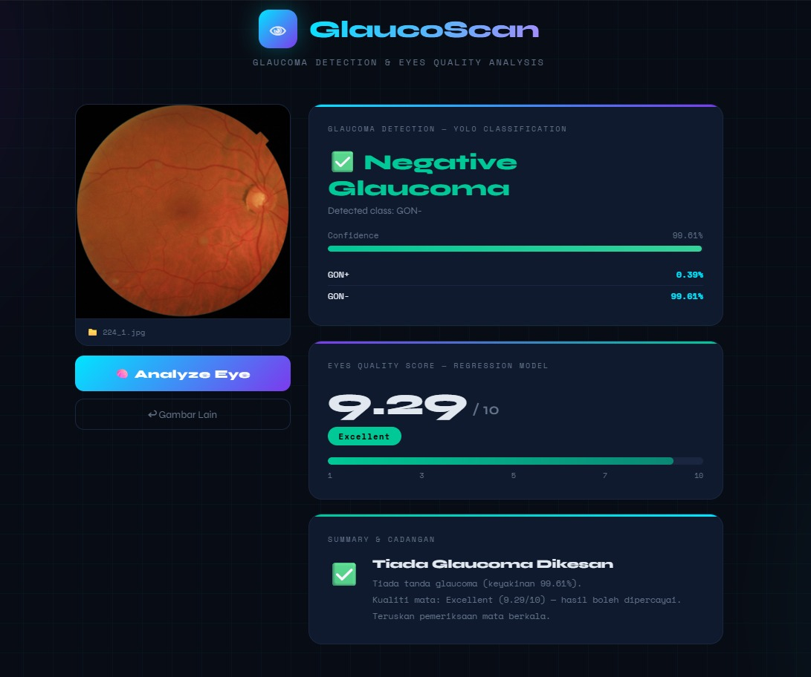

# GlaucoScan — Eye Analysis System
### YOLO Glaucoma Detection + MobileNetV2 Quality Regression



---

## 📁 Struktur Folder

```
glaucoma_system/
├── app.py                  ← Main Flask server
├── requirements.txt        ← Python dependencies
├── README.md               ← Panduan ni
└── templates/
    └── index.html          ← Web interface
```

---

## 🧠 Model Files

Model weights **tidak disertakan dalam branch ini** kerana saiz fail yang besar.

| Model | Branch | Path dalam branch |
|-------|--------|-------------------|
| YOLO Glaucoma Detection (`.pt`) | `project-eyes` | `hillel-yaffe-glaucoma/hillel-yaffe-glaucoma/yolo11n-cls.pt` |
| Image Regression MobileNetV2 (`.pth`) | `project-eyes` | `outputs/best_model.pth` |

Download model dari branch `project-eyes` dan letakkan mengikut path dalam `app.py`.

---

## ⚙️ Setup (Buat Sekali Sahaja)

### Step 1 — Install dependencies
```bash
pip install flask torch torchvision ultralytics Pillow numpy
```

### Step 2 — Tukar path dalam app.py
Buka `app.py` dan tukar 2 baris ni:

```python
YOLO_WEIGHT_PATH       = r"C:\Users\Arif\Desktop\Project_Eyes\hillel-yaffe-glaucoma\hillel-yaffe-glaucoma\yolo11n-cls.pt"
REGRESSION_WEIGHT_PATH = r"C:\Users\Arif\Desktop\Project_Eyes\outputs\best_model.pth"
```

### Step 3 — Tukar SCORE_MIN dan SCORE_MAX (PENTING!)
Dalam `app.py`, cari baris ni dan tukar ikut nilai dataset anda:

```python
SCORE_MIN = 0.0   # ← nilai minimum score dalam Labels.csv anda
SCORE_MAX = 10.0  # ← nilai maximum score dalam Labels.csv anda
```

Kalau tak tahu nilai ni, jalankan kod ni dalam Python:
```python
import pandas as pd
df = pd.read_csv(r"PATH\TO\Labels.csv")
print("MIN:", df.iloc[:, 3].min())
print("MAX:", df.iloc[:, 3].max())
```

---

## 🚀 Cara Jalankan

```bash
cd C:\path\to\glaucoma_system
python app.py
```

Kemudian buka browser:
```
http://127.0.0.1:5000
```

---

## 🎯 Cara Guna

1. Drop gambar mata ke dalam kotak upload
2. Klik **"Analyze Eye"**
3. Sistem akan jalankan:
   - 🔍 **YOLO** → detect Glaucoma Positive / Negative
   - 📊 **Regression** → bagi Quality Score (%)
4. Hasil keluar dengan status glaucoma + confidence % + quality score

---

## ⚠️ Notes Penting

| Benda | Keterangan |
|-------|------------|
| SCORE_MIN/MAX | MESTI sama dengan nilai dalam training dataset |
| GPU/CPU | System auto-detect — GPU lagi laju |
| Image format | JPG, PNG, BMP semua boleh |
| Port | Default 5000 — boleh tukar dalam app.py |

---

## 🔧 Troubleshooting

**Error: Model not found**
→ Semak semula path dalam `app.py`

**Error: CUDA out of memory**
→ Tukar `DEVICE = torch.device("cpu")` dalam `app.py`

**Port already in use**
→ Tukar port: `app.run(port=5001)`

**Hasil tak tepat**
→ Pastikan SCORE_MIN dan SCORE_MAX betul ikut dataset anda
